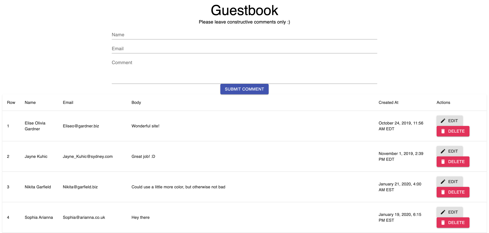

# Guestbook
A fullstack JavaScript app that allows a user to add comments to a web app. It also shows the wonderful magic of GraphQL, Apollo, and React.

[Full presentation - Creating an app with Apollo](https://slides.com/marianlumba/apollo)



Both folders (client/server) are separate apps that need to be run separately.

To view the frontend:
```
cd client
npm start
```

To run the backend:
```
1. cd server
2. create .env file with MONGO_CONNECT_URL from .env.example in server directory
3. npm start
```

Check out the _presentation_ branch if you'd like to see further commented code and details on how `useQuery` and `useMutation` hooks work!

### Learn GraphQL/Apollo
Want to know how you can make an app like this? Take a look at the resources below:

[How to GraphQL](http://howtographql.com) 

_Also includes front/back end tutorials for all stacks_

[GraphQL Docs](https://graphql.org/learn/) 

[Learning GraphQL (O’Reilly book)](http://shop.oreilly.com/product/0636920137269.do)

[Apollo Fullstack Tutorial](https://www.apollographql.com/docs/tutorial/schema/)

[Apollo Client Tutorial (latest)](https://www.apollographql.com/docs/react/v3.0-beta/get-started/) 

[Apollo Server Tutorial](https://www.apollographql.com/docs/apollo-server/getting-started/) 

[Apollo FAQ](https://www.apollographql.com/docs/resources/faq/) 

_Also contains relevant info on getting started with GraphQL and adopting GraphQL into established projects_

[Wes Bos Advanced React Course](https://advancedreact.com/)

[GraphQL Boilerplates (GraphQL Server only)](https://github.com/graphql-boilerplates)

[React Fullstack GraphQL](https://github.com/graphql-boilerplates/react-fullstack-graphql)